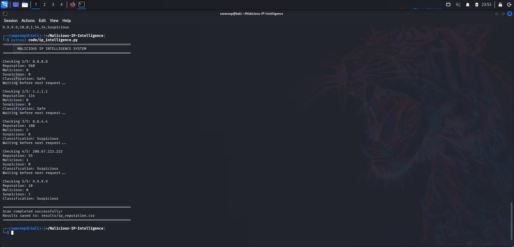
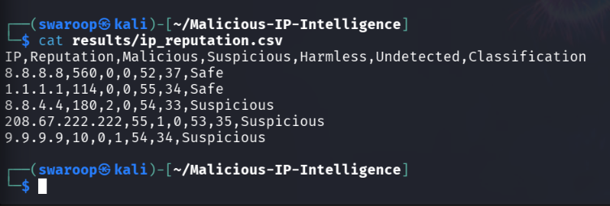

# 🛡️ Malicious IP Intelligence System

A Python-based cybersecurity project that analyzes IP address reputation using the VirusTotal API and classifies IPs as **Safe, Suspicious, or Malicious** using a project-defined classification rule.

## 🎯 Project Objective

The objective of this project is to automate basic IP reputation analysis using threat intelligence data and generate a structured report of the findings.

## 🔍 Features

- Reads IP addresses from a text file
- Queries VirusTotal for IP reputation
- Extracts malicious, suspicious, harmless, and undetected results
- Applies a project-defined classification rule
- Generates a CSV report of the analysis
- Uses an environment variable to protect the API key

## 🛠️ Technologies Used

- Python
- VirusTotal API
- Requests
- Kali Linux
- CSV

## 📁 Project Structure

```text
malicious-ip-intelligence-system/
├── README.md
├── code/
│   └── ip_intelligence.py
├── data/
│   └── ip_list.txt
├── results/
│   └── ip_reputation.csv
└── screenshots/
    ├── execution.png
    └── results.png

⚙️ Methodology
Collect a list of IP addresses.
Read the IP addresses using Python.
Send each IP address to the VirusTotal API.
Retrieve reputation and analysis statistics.
Classify each IP based on the project-defined rule.
Store the results in a CSV file.
🏷️ Classification Rule
Condition	Classification
Malicious detections ≥ 3	Malicious
Malicious detections 1–2 OR Suspicious detections ≥ 1	Suspicious
Malicious = 0 AND Suspicious = 0	Safe

Note: This is a project-defined classification rule and is not an official VirusTotal classification.

▶️ How to Run
1. Install the required package
pip install requests
2. Set the VirusTotal API key

For Kali Linux:

```bash
export VT_API_KEY="YOUR_VIRUSTOTAL_API_KEY"
```

### 3. Run the Script

From the repository root:

```bash
python3 code/ip_intelligence.py
```

The script reads IP addresses from:

```text
data/ip_list.txt
```

and generates:

```text
results/ip_reputation.csv
```

## 📊 Sample Results

| IP | Reputation | Malicious | Suspicious | Classification |
|---|---:|---:|---:|---|
| 8.8.8.8 | 560 | 0 | 0 | Safe |
| 1.1.1.1 | 114 | 0 | 0 | Safe |
| 8.8.4.4 | 180 | 2 | 0 | Suspicious |
| 208.67.222.222 | 55 | 1 | 0 | Suspicious |
| 9.9.9.9 | 10 | 0 | 1 | Suspicious |

The analysis resulted in 2 Safe and 3 Suspicious classifications using the project-defined rule. No IP reached the project's Malicious threshold.

A single detection should not automatically be treated as proof that an IP is malicious.

## 📸 Screenshots

### Script Execution



### Generated Results



## 🔐 Security Note

Never commit your VirusTotal API key to GitHub.

The script expects the API key through the `VT_API_KEY` environment variable.

## 🚀 Future Scope

- Integrate additional threat intelligence sources such as AbuseIPDB
- Analyze IP addresses directly from network logs
- Add automated security alerts
- Develop a web-based dashboard
- Maintain historical IP reputation data

## 📚 Learning Outcomes

This project provided hands-on experience with:

- Python scripting
- REST API integration
- Threat intelligence
- IP reputation analysis
- CSV data processing
- Basic cybersecurity investigation
- Secure handling of API credentials
